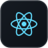
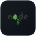
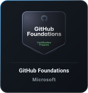
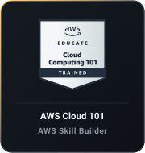

<div align="center">
  
</div>

<div align="center">
  
  
  
  
  
  
  
  
  
  
  
  
  
  
  
  
  
  
  
  
  
  
  
  
  
  
</div>

<br/>

<div align="center">
  <table>
    <tr>
      <td align="center" valign="middle">
        <a href="https://www.coursera.org/account/accomplishments/specialization/19BS5LQAH3S6" target="_blank">
          
        </a>
      </td>
      <td align="center" valign="middle">
        <a href="https://learn.microsoft.com/en-us/users/johnkennyreyes/credentials/2137385954e901b0" target="_blank">
          
        </a>
      </td>
      <td align="center" valign="middle">
        <a href="https://www.credly.com/badges/82f29036-484c-48ac-a357-c9663eb453f0/public_url" target="_blank">
          
        </a>
      </td>
    </tr>
  </table>
</div>

<br/>

<div align="center">
  
</div>

<br/>

<!--START_SECTION:waka-->


📊 **This Week I Spent My Time On** 

```text
💬 Programming Languages: 
Markdown                 10 hrs 22 mins      ███████████████░░░░░░░░░░   59.51 % 
TOML                     2 hrs 18 mins       ███░░░░░░░░░░░░░░░░░░░░░░   13.28 % 
Python                   1 hr 33 mins        ██░░░░░░░░░░░░░░░░░░░░░░░   08.96 % 
Bash                     51 mins             █░░░░░░░░░░░░░░░░░░░░░░░░   04.88 % 
HTML                     35 mins             █░░░░░░░░░░░░░░░░░░░░░░░░   03.38 % 

🔥 Editors: 
Claude Code              9 hrs 17 mins       █████████████░░░░░░░░░░░░   53.31 % 
Antigravity CLI          5 hrs 8 mins        ███████░░░░░░░░░░░░░░░░░░   29.45 % 
VS Code                  1 hr 39 mins        ██░░░░░░░░░░░░░░░░░░░░░░░   09.53 % 
Codex CLI                1 hr 14 mins        ██░░░░░░░░░░░░░░░░░░░░░░░   07.14 % 
Codex Exec               5 mins              ░░░░░░░░░░░░░░░░░░░░░░░░░   00.57 % 

🐱‍💻 Projects: 
batdimoiprint            4 hrs 58 mins       ███████░░░░░░░░░░░░░░░░░░   28.48 % 
waybar                   3 hrs 29 mins       █████░░░░░░░░░░░░░░░░░░░░   20.06 % 
PALATTAO-LAW             1 hr 52 mins        ███░░░░░░░░░░░░░░░░░░░░░░   10.77 % 
CAPSTONE                 1 hr 39 mins        ██░░░░░░░░░░░░░░░░░░░░░░░   09.53 % 
prince-it-solutions      1 hr 11 mins        ██░░░░░░░░░░░░░░░░░░░░░░░   06.87 % 
```

**I Mostly Code in TypeScript** 

```text
TypeScript               18 repos            ████████░░░░░░░░░░░░░░░░░   32.73 % 
Python                   5 repos             ██░░░░░░░░░░░░░░░░░░░░░░░   09.09 % 
HTML                     5 repos             ██░░░░░░░░░░░░░░░░░░░░░░░   09.09 % 
Shell                    3 repos             █░░░░░░░░░░░░░░░░░░░░░░░░   05.45 % 
C                        2 repos             █░░░░░░░░░░░░░░░░░░░░░░░░   03.64 % 
```


 Last Updated on 30/08/2026 21:22:06 UTC
<!--END_SECTION:waka-->
