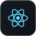
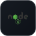
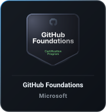
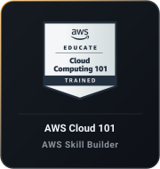

<div align="center">
  
</div>

<div align="center">
  
  
  
  
  
  
  
  
  
  
  
  
  
  
  
  
  
  
  
  
  
  
  
  
  
  
</div>

<br/>

<div align="center">
  <table>
    <tr>
      <td align="center" valign="middle">
        <a href="https://www.coursera.org/account/accomplishments/specialization/19BS5LQAH3S6" target="_blank">
          
        </a>
      </td>
      <td align="center" valign="middle">
        <a href="https://learn.microsoft.com/en-us/users/johnkennyreyes/credentials/2137385954e901b0" target="_blank">
          
        </a>
      </td>
      <td align="center" valign="middle">
        <a href="https://www.credly.com/badges/82f29036-484c-48ac-a357-c9663eb453f0/public_url" target="_blank">
          
        </a>
      </td>
    </tr>
  </table>
</div>

<br/>

<div align="center">
  
</div>

<br/>

<!--START_SECTION:waka-->


📊 **This Week I Spent My Time On** 

```text
💬 Programming Languages: 
Other                    10 hrs 26 mins      ████████████░░░░░░░░░░░░░   49.11 % 
Markdown                 6 hrs 59 mins       ████████░░░░░░░░░░░░░░░░░   32.88 % 
TypeScript               1 hr 8 mins         █░░░░░░░░░░░░░░░░░░░░░░░░   05.40 % 
JavaScript               57 mins             █░░░░░░░░░░░░░░░░░░░░░░░░   04.51 % 
Bash                     43 mins             █░░░░░░░░░░░░░░░░░░░░░░░░   03.40 % 

🔥 Editors: 
Claude Code              12 hrs 13 mins      ██████████████░░░░░░░░░░░   57.46 % 
Antigravity CLI          4 hrs 13 mins       █████░░░░░░░░░░░░░░░░░░░░   19.84 % 
VS Code                  2 hrs 8 mins        ███░░░░░░░░░░░░░░░░░░░░░░   10.07 % 
Codex Vscode             2 hrs               ██░░░░░░░░░░░░░░░░░░░░░░░   09.44 % 
Codex CLI                40 mins             █░░░░░░░░░░░░░░░░░░░░░░░░   03.17 % 

🐱‍💻 Projects: 
AI-VA                    7 hrs 52 mins       █████████░░░░░░░░░░░░░░░░   36.99 % 
commandCenter            1 hr 33 mins        ██░░░░░░░░░░░░░░░░░░░░░░░   07.36 % 
batdimoiprint            1 hr 31 mins        ██░░░░░░░░░░░░░░░░░░░░░░░   07.15 % 
PEPETON                  1 hr 23 mins        ██░░░░░░░░░░░░░░░░░░░░░░░   06.51 % 
PALATTAO-LAW             1 hr 21 mins        ██░░░░░░░░░░░░░░░░░░░░░░░   06.35 % 
```

**I Mostly Code in TypeScript** 

```text
TypeScript               22 repos            █████████░░░░░░░░░░░░░░░░   37.29 % 
HTML                     6 repos             ███░░░░░░░░░░░░░░░░░░░░░░   10.17 % 
Python                   5 repos             ██░░░░░░░░░░░░░░░░░░░░░░░   08.47 % 
C                        2 repos             █░░░░░░░░░░░░░░░░░░░░░░░░   03.39 % 
Shell                    2 repos             █░░░░░░░░░░░░░░░░░░░░░░░░   03.39 % 
```


 Last Updated on 02/10/2026 22:26:33 UTC
<!--END_SECTION:waka-->
